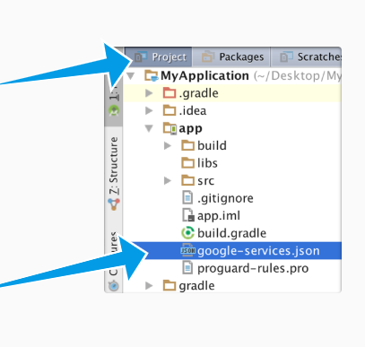

# AiLaTrieuPhu_Firebase
#### Đề tài: Game Ai là triệu phú

Đồ án cuối kỳ môn Thiết kế ứng dụng di động(Android), sử dụng Firebase realtime database để lưu trữ

#### **DEADLINE: 22/6/2019**
# Yêu cầu
Tải về: [google-services](https://console.firebase.google.com/m/mobilesdk/projects/544622484354/clients/android%3Acom.sire.fireflame/artifacts/2?param=%5B%22getArtifactRequest%22%2Cnull%2C%22android%3Acom.sire.fireflame%22%2C%222%22%2C%22544622484354%22%5D&authuser=1) và lưu theo hình

# To-do:
### 17/5/2019
  - [ ] Fix âm thanh khi chuyển app
  - [ ] Thêm điểm cao khi chơi xong (Tối đa 9 người, không trùng tên) (Đã đc nhưng bug vcl)
### 15/5/2019
  - [X] Chơi
  - [ ] Fix âm thanh khi chuyển app
  - [ ] Thêm điểm cao khi chơi xong (Tối đa 10 người, không trùng tên)
### 14/5/2019
  - [X] Chơi
  - [X] Tương tác Firebase
  - [X] Điểm cao
